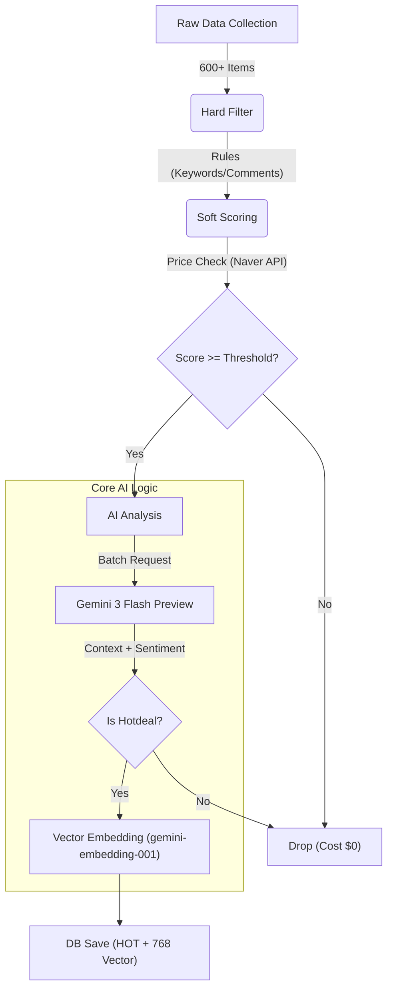

# 커뮤니티의 핫딜 정보를 주기적으로 크롤링 및 LLM 기반의 필터링 엔진

## 1. 데이터 소스 및 수집 범위
- **타겟 사이트**:
    - 커뮤니티 핫딜 게시판(현재는 3개의 커뮤니티)
- **수집 규모**: 실행 당 약 **600~700개** 아이템.
- **수집 주기**: 매일 2회 (00:00, 12:00 KST).
- **수집 범위**: 실행 시점 기준, **지난 24시간** 이내에 작성된 모든 게시글 (데이터 누락 방지).
- **수집 데이터**:
    - **제목 (Title)**: 핫딜 제목.
    - **링크 (Link)**: 커뮤니티 게시글 링크가 아닌 **실제 판매처 상품 링크**
    - **가격 (Price)**: 제목 또는 본문에서 추출.
    - **반응 (Engagement)**: 추천 수, 댓글, 댓글 수.
    - **날짜 (Date)**: 게시 시간.

## 2. 필터링 및 분석 파이프라인 (Filtering & Analysis Pipeline)
AI 비용 절감을 위해 3단계 깔때기(Funnel) 아키텍처를 사용합니다.



### 1단계: 하드 필터 (Hard Filter) - 규칙 기반 즉시 삭제
**다음 조건에 해당하면 비용 발생 없이 즉시 삭제됩니다 (Cost: $0):**
1.  **상태 키워드**: "종료", "품절", "매진", "취소".
2.  **유형 키워드**: "광고", "제휴", "체험단".
3.  **반응 미달**: **댓글 수 3개 미만**.
    - **예외 처리 (Time Decay)**: 작성 30분 미만의 신규 글은 댓글이 1개만 있어도 삭제하지 않습니다.
4.  **가격 정보 없음**: 제목에 유효한 가격 패턴이 없음.

### 2단계: 소프트 스코어링 (Soft Scoring) - 가산점 부여
**단순 필터링이 아닌 점수제(Score)를 도입하여 AI 분석 대상을 선별합니다.**
   - **생필품 키워드**: 식품, 세제, 휴지 등 생필품 관련 키워드 가산점.
   - **반응 속도 (Velocity)**: `(댓글수+1) / (경과시간+10)^1.5` 공식을 사용, 게시 직후 빠르게 반응이 오는 글에 높은 가산점 부여.
   - **가격 검증 (Price Check - 단가 및 배송비 정밀 분석)**:
        - **검색 최적화**: 핫딜 제목 앞부분의 마케팅 문구(예: `[특가]`, `(무배)`)를 제거하고 네이버쇼핑 API를 통해 가장 정확한 검색 결과를 가져옵니다.
        - **단가(Unit Price) 비교**: 단순 총액 비교가 아닌, 네이버 결과와 핫딜 제목에서 각각의 상품 수량(예: 30롤, 12병 등)을 자동 추출해 1단위 당 가격을 비교합니다.
        - **배송비 반영**: "무료배송", "무배" 등의 키워드가 없으면 기본 배송비(3,000원)를 포함하여 총 비용을 계산한 후 단가를 산출(`(상품가 + 배송비) / 수량`)합니다.
        - **하드 드롭**: `핫딜 단가 > 네이버 단가` (단가 기준 네이버 최저가보다 비쌈) -> 즉시 탈락.
        - **소프트 스코어링 가산점**:
            - 단가 15% 이상 저렴 (`단가 비율 < 0.85`): **+3점** 부여.
            - 단가 10% 이상 저렴 (`단가 비율 < 0.90`): **+2점** 부여.
            - 보너스 절대 절약 금액 큰 경우 (`총 절약 금액 > 30,000원`): **+2점** 부여.
        - **절약 금액 제공(Savings)**: `(네이버 단가 - 핫딜 단가) * 핫딜 수량` 방식으로 실질적인 총 절감액을 계산해 AI에게 제공합니다. (이 값이 크면 다른 조건이 다소 부족해도 AI가 HOT딜로 판단할 확률이 높아집니다)

### [핵심] 3단계: AI 심층 분석 (Gemini 3 Flash Preview)
**최종 선별된 "READY" 상태의 대량의 데이터(약 150-300개)가 한 번에 LLM으로 전송됩니다.**
- *최적화 포인트: LLM API 호출(RPD) 제한을 아끼기 위해 150-300건의 데이터를 한 번의 프롬프트로 묶어서 전송합니다. 이때, LLM은 내부 기준을 통과한 진짜 "HOT" 딜만 추려서 JSON으로 반환하도록 지시받습니다. (개수 제한을 둔 것은 아니며, 통계적으로 엄격한 필터를 통과하는 최종 알짜배기 핫딜이 150건 중 평균 10-20건 내외로 도출됩니다). 이를 통해 답변 길이를 획기적으로 줄여, 토큰 초과로 인한 전체 파싱 에러(JSONDecodeError)를 원천 차단합니다.*

- **Input (AI에게 제공되는 정보)**:
    - `제목`: 상품명 및 구성.
    - `가격 정보`: 할인가, 네이버 최저가, **절약 금액(Savings)**.
    - `사용자 반응`: **댓글 원문 5개 (Sentiment Source)**, 추천 수, 반응 속도 점수.
- **Processing (AI의 역할)**:
    - **가치 및 카테고리 판단**: 생필품(식품, 세제 등)뿐만 아니라 가격 메리트가 확실한 전자제품, 영양제, 생활 가전 등 유용한 일반 상품들도 폭넓게 "HOT"으로 판독합니다.
    - **감성 분석**: "쟁여둔다", "역대가" 등 긍정적 표현 식별. 댓글 수가 적더라도 할인 요건(Savings)이 크면 핫딜로 자동 편입시킵니다.
    - **바이럴 필터링**: 댓글에 "바이럴", "광고", "비추" 등의 불만 피드백이 강력할 경우 점수를 깎아 가차없이 DROP 시킵니다.
- **Output (결과물)**:
    - `Status`: **HOT** / DROP / MAYBE
    - `AI Summary`: **쇼핑 호스트 톤**의 3줄 요약 큐레이션 (예: "📢 역대급 가격! 놓치면 후회할 구성입니다.")
    - `Sentiment Score`: 댓글 반응 기반 **0~100점** 감성 점수.
    - `Category`: 분류된 카테고리 태그. 태그되지 않은(명단에 없는) 상품은 자동으로 탈락(DROP) 처리됩니다.
    - `Embedding`: **의미 기반 AI 검색(Semantic Search)**을 지원하기 위한 768차원 모델(`gemini-embedding-001`) 벡터 데이터 추출 및 DB 연동.

## 3. 저장 및 출력 시스템
-   **스마트 캐싱**: `hash(제목 + 링크)`를 키로 사용하되, **날짜(Date)**가 변경되면 캐시를 만료시켜 매일 새로운 딜을 놓치지 않고 수집합니다.
-   **DB 저장 (Supabase)**:
    -   `hotdeals`: 핫딜 정보 및 **AI 분석 데이터(감성 점수, 카테고리 등)**.
    -   `pgvector` 통합 (Vector Search): 의미적 맥락(Semantic context) 768차원 배열 벡터 공간에 데이터를 밀어넣어 프론트엔드 자연어 검색에 대응.
    -   `crawl_stats`: 매 실행 시 수집/필터/저장 수치 및 **총 절약 금액(Total Savings)** 기록.
    -   **신고 시스템**: `report_count` 컬럼을 통해 프론트엔드 유저 신고 반영.
-   **스케줄러**: GitHub Actions를 통해 **매일 00:00, 12:00 KST**에 자동 실행됩니다. (`cron: '0 3,15 * * *'`)

## 4. 환경 변수 (Secrets)
실행을 위해 GitHub Actions Secrets 또는 로컬 `.env` 파일에 다음 키가 필요합니다:
- `GEMINI_API_KEY`: Google Gemini 데이터 분석용
- `SUPABASE_URL` / `SUPABASE_KEY`: 데이터베이스 저장용
- `NAVER_CLIENT_ID` / `NAVER_CLIENT_SECRET`: 네이버쇼핑 최저가 검색(API) 가격 검증용

## 4. 프로젝트 구조
```bash
.
├── app/                  # 핵심 애플리케이션 코드
│   ├── core/             # 분석기(Analyzer), DB, 설정 등 공통 로직
│   ├── crawlers/         # 사이트별 크롤러 (community_1, community_2, community_3)
│   └── models/           # 데이터 모델 (Deal)
├── sql/                  # DB 스키마 및 마이그레이션 SQL 파일들
├── .github/workflows/    # 자동화 스케줄 설정 (daily_crawl.yml)
└── run_once.py           # [Main] 파이프라인 실행 진입점
```
